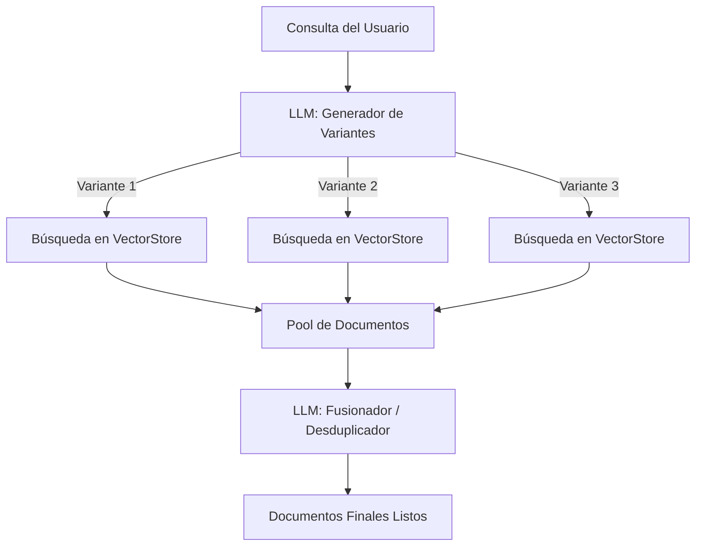

# 🧠 Lección 8: MultiQueryRetriever - Recuperación Avanzada con IA

## 🏹 Una Nueva Capa de Inteligencia

En las lecciones anteriores aprendimos a usar los **Retrievers** básicos para recuperar información de nuestras bases de datos vectoriales. Sin embargo, una de las mayores ventajas de LangChain es su **interoperabilidad**: la capacidad de extender componentes simples con capas de Inteligencia Artificial.

Hoy presentamos el **MultiQueryRetriever**, un componente que utiliza un LLM (Modelo de Lenguaje) para actuar como un "puente inteligente" entre la pregunta del usuario y nuestra base de datos.

---

## 🛠️ ¿Cómo funciona realmente el MultiQueryRetriever?

El proceso que sigue este componente es mucho más sofisticado que una búsqueda simple. Se divide en tres fases críticas:

### 1. Reformulación Dinámica (Query Expansion)
El sistema recibe la consulta original y, utilizando un LLM, genera **múltiples variantes** con sinónimos y subconsultas relacionadas.

> [!TIP]
> **Ejemplo de Reformulación de Consulta:**
> *   **Consulta Original:** "¿Cuál es la capital de Francia?"
> *   **Variante A:** "Ciudad sede del gobierno francés"
> *   **Variante B:** "Capital de la República Francesa"
> *   **Variante C:** "Ubicación del centro administrativo de Francia"

### 2. Búsqueda Multi-Ángulo
En lugar de lanzar una sola búsqueda, el MultiQueryRetriever lanza **una búsqueda por cada variante** sobre tu base de datos (Vector Store), utilizando tu medida de similitud habitual (como el coseno).

### 3. Fusión y Desduplicación (El paso clave)
Tras obtener todos los resultados de las diferentes búsquedas, el LLM analiza los documentos recuperados. En este paso, el sistema:
*   **Fusiona:** Junta toda la información relevante de las distintas variantes.
*   **Desduplica:** Elimina fragmentos idénticos o redundantes, asegurando que solo recibas la información única y necesaria.

---

## 📊 Arquitectura del Flujo de Trabajo



---

## ⚙️ Implementación Paso a Paso (Google Gemini)

Para implementar este flujo avanzado en tu curso, combinaremos nuestro **Retriever Base** con la potencia de **Google Gemini**.

```python
from langchain_google_genai import ChatGoogleGenerativeAI
from langchain_classic.retrievers.multi_query import MultiQueryRetriever

# 1. Configuramos el cerebro de la operación (Gemini 2.5 Flash)
# Usamos una temperatura baja (0) para que la reformulación sea determinista y precisa.
llm_ia = ChatGoogleGenerativeAI(model="models/gemini-2.5-flash", temperature=0)

# 2. Definimos nuestro Retriever Base
# Es el comportamiento por defecto sobre nuestra base de datos Chroma.
base_retriever = vectorstore.as_retriever(search_type="similarity", search_kwargs={"k": 2})

# 3. Instanciamos el MultiQueryRetriever
# Envolvemos el retriever base con el LLM para darle "inteligencia".
retriever_avanzado = MultiQueryRetriever.from_llm(
    retriever=base_retriever, 
    llm=llm_ia
)

# 4. Invocación estándar
# Implementa la misma interfaz (.invoke) que hemos visto anteriormente.
resultados = retriever_avanzado.invoke(consulta)
```

---

## ⚖️ Ventajas y Observaciones Reales

*   **¿Por qué recibo menos documentos?** Es posible que pidas un `k=2` pero recibas solo un documento. Esto es **una buena señal**: significa que el LLM ha detectado que los fragmentos recuperados por las diferentes variantes eran duplicados y los ha filtrado para no ensuciar el contexto final.
*   **Precisión extrema:** En el caso de contratos o documentos legales complejos, este método es capaz de localizar direcciones o datos específicos (como la calle Tetuán en Sevilla) aunque la pregunta del usuario no use exactamente las palabras del documento.

> [!IMPORTANT]
> El MultiQueryRetriever es más lento que un retriever básico porque requiere varias llamadas a la API de la IA, pero la **calidad de la información recuperada** es infinitamente superior.

---

## 🚀 Próximos pasos
Existen muchos tipos de Retrievers avanzados (**Contextual Compression**, **Multi-Vector**, **Parent Document**, etc.). Lo más relevante es entender en qué consisten, dónde se incorporan dentro de nuestro flujo de gestión y cómo podemos extender nuestras capacidades de búsqueda con IA.
