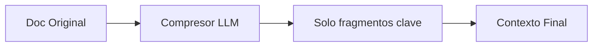
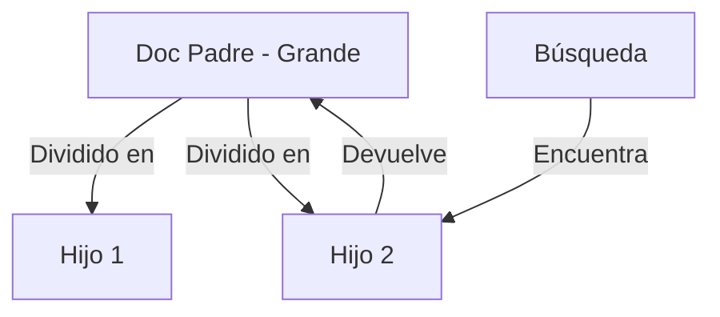

# 📚 Lectura: Los Retrievers más Potentes de LangChain

Los **Retrievers** constituyen el corazón de cualquier sistema **RAG (Retrieval-Augmented Generation)** exitoso. LangChain ha evolucionado para ofrecer una amplia gama de retrievers sofisticados que van mucho más allá de la simple búsqueda por similitud. 

En este artículo, exploraremos los componentes que están transformando la manera en que las aplicaciones de IA acceden y procesan información.

---

## 🏗️ ¿Qué es realmente un Retriever?

Un retriever en LangChain es una **interfaz** que recibe una consulta en lenguaje natural y devuelve documentos relevantes. 

> [!NOTE]
> **Diferencia Clave:** A diferencia de los *Vector Stores*, los retrievers no necesitan almacenar documentos, solo recuperarlos. Son el "mensajero inteligente" que sabe dónde y cómo buscar.

### Características clave:
*   **Entrada:** Un simple `string` de consulta.
*   **Salida:** Una lista de objetos de tipo `Document`.
*   **Interoperabilidad:** Implementan la interfaz **Runnable**, lo que los hace 100% compatibles con **LCEL** (LangChain Expression Language).

---

## 1️⃣ MultiQueryRetriever: La Perspectiva Múltiple

### 💡 El Problema
La búsqueda por similitud a veces falla porque el usuario no usa las palabras exactas que están en el documento (ej. busca "canino" pero el texto dice "perro").

### 🚀 La Solución
Utiliza un LLM para generar **múltiples variantes** de la consulta original. Lanza varias búsquedas y luego combina y desduplica los resultados.

```python
from langchain_google_genai import ChatGoogleGenerativeAI
from langchain_classic.retrievers.multi_query import MultiQueryRetriever

# Configuramos el "cerebro"
llm = ChatGoogleGenerativeAI(model="models/gemini-2.0-flash", temperature=0)

retriever_mq = MultiQueryRetriever.from_llm(
    retriever=vectorstore.as_retriever(),
    llm=llm
)
```

---

## 2️⃣ ContextualCompressionRetriever: El Filtro Inteligente

### 💡 El Problema
A veces un documento recuperado es enorme (ej. 2000 palabras) pero solo una frase es relevante para la pregunta. Pasar el documento entero al LLM gasta tokens y añade ruido.

### 🚀 La Solución
Extrae únicamente los fragmentos relevantes de cada documento antes de entregarlos, "comprimiendo" el contexto.



```python
from langchain.retrievers import ContextualCompressionRetriever
from langchain.retrievers.document_compressors import LLMChainExtractor

# El compresor filtrará el ruido
compressor = LLMChainExtractor.from_llm(llm)

compression_retriever = ContextualCompressionRetriever(
    base_compressor=compressor,
    base_retriever=vectorstore.as_retriever()
)
```

---

## 3️⃣ EnsembleRetriever: El Híbrido Perfecto

### 💡 El Problema
La búsqueda semántica (vectores) es buena para conceptos, pero la búsqueda por palabras clave (BM25) es mejor para nombres técnicos o códigos específicos.

### 🚀 La Solución
Combina múltiples retrievers (ej. uno de base de datos vectorial y otro de búsqueda por texto) y pondera sus resultados usando el algoritmo **RRF (Reciprocal Rank Fusion)**.

```python
from langchain.retrievers import EnsembleRetriever
from langchain_community.retrievers import BM25Retriever

# 30% importancia a palabras clave, 70% a semántica
ensemble_retriever = EnsembleRetriever(
    retrievers=[bm25_retriever, vector_retriever],
    weights=[0.3, 0.7]
)
```

---

## 4️⃣ ParentDocumentRetriever: Precisión con Contexto

### 💡 El Problema
Si guardas trozos muy pequeños, el embedding es muy preciso pero pierdes el contexto. Si guardas trozos muy grandes, el embedding es genérico y la búsqueda falla.

### 🚀 La Solución
Busca usando fragmentos pequeños (**hijos**), pero cuando encuentra uno, recupera el documento grande (**padre**) al que pertenece.



---

## 5️⃣ SelfQueryRetriever: Búsqueda Estructurada

### 🚀 La Solución
Utiliza el LLM para transformar la pregunta del usuario en un **filtro estructurado**. 
*   **Usuario:** "Cursos de Python de más de 4 estrellas".
*   **Retriever:** Genera un filtro `{"rating": {"$gt": 4}, "topic": "Python"}` y busca en los metadatos de la base de datos.

---

## 6️⃣ TimeWeightedRetriever: Memoria que Desvanece

### 💡 El Problema
En aplicaciones de noticias o soporte técnico, la información de ayer suele ser más relevante que la de hace 3 años.

### 🚀 La Solución
Asigna un "peso" basado en el tiempo. A medida que un documento envejece, su relevancia disminuye automáticamente siguiendo una tasa de decaimiento.

---

## 🛠️ Técnicas de Post-Procesamiento

### Reranking (Re-ordenación)
Recuperas muchos documentos (ej. 20) con una búsqueda barata y luego usas un modelo de **Rerank** (como Cohere) para seleccionar los 5 mejores. Es la forma más eficiente de mejorar la precisión en producción.

### MMR (Maximum Marginal Relevance)
Busca documentos que sean relevantes pero **diferentes** entre sí. Ayuda a evitar que la IA reciba 5 documentos que dicen exactamente lo mismo, aumentando la diversidad del contexto.

---

> [!IMPORTANT]
> **Conclusión para el Alumno:**
> No existe un "mejor" retriever universal. El éxito depende de entender tu dataset. Si tienes documentos técnicos, usa un **Ensemble**. Si tienes documentos muy largos, usa **ParentDocument** o **Compression**.

---
*Este artículo forma parte del Módulo de RAG Avanzado de la formación en LangChain.*