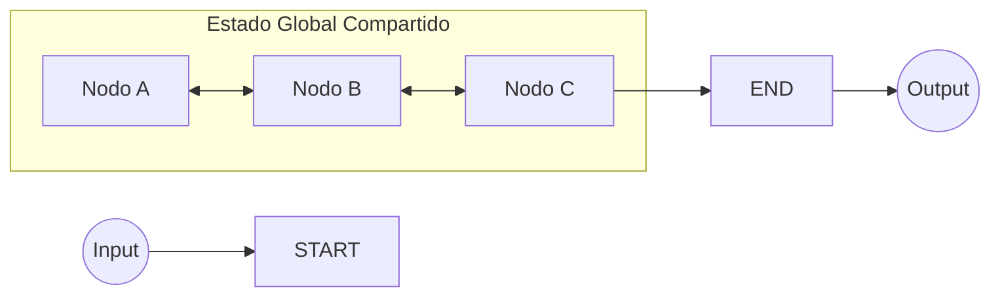

# Introducción a LangGraph: Más allá de las Cadenas Lineales

Bienvenidos a la sección de **LangGraph**. En esta lección, exploraremos qué es LangGraph, por qué representa la evolución lógica de LangChain y cómo sus componentes fundamentales nos permiten construir aplicaciones de IA sofisticadas y no lineales.

---

## 1. ¿Qué es LangGraph?

Muchos desarrolladores se preguntan si LangGraph viene a sustituir a LangChain. La respuesta es **no**. 

**LangGraph es una extensión del ecosistema LangChain** que complementa el framework con características adicionales. Utiliza las mismas interfaces, abstracciones y clases que ya conocemos, pero introduce un paradigma de control de flujo mucho más potente.

### Evolución de LangChain
*   **LangChain (LCEL):** Diseñado principalmente para **grafos dirigidos acíclicos (DAGs)** o cadenas lineales. La salida de un paso es la entrada del siguiente.
*   **LangGraph:** Permite crear **grafos con ciclos y bucles**. Podemos modelar iteraciones y recorridos no lineales directamente dentro del framework, sin depender de estructuras externas de Python (como bucles `while` o `for` manuales).

---

## 2. Limitaciones de las Cadenas Tradicionales vs. LangGraph

| Característica | LangChain Tradicional (LCEL) | LangGraph |
| :--- | :--- | :--- |
| **Flujo de Ejecución** | Lineal y secuencial. | No lineal, permite ciclos y bucles. |
| **Ramificación (Branching)** | Difícil de implementar de forma nativa. | Soportado mediante aristas condicionales. |
| **Gestión de Estado** | Información fluye de paso en paso. | **Estado Global Compartido** entre todos los nodos. |
| **Casos de Uso** | Prototipos rápidos, flujos directos. | Agentes complejos, flujos iterativos, multi-agente. |

---

## 3. El Paradigma del StateGraph

El concepto central de LangGraph es el **StateGraph**. A diferencia de una cadena donde los datos pasan de mano en mano, en un StateGraph todos los nodos orbitan alrededor de un estado común.

### Arquitectura de un StateGraph

---

## 4. Componentes Fundamentales

Para dominar LangGraph, debemos comprender tres conceptos clave:

### A. State (Estado) — La Memoria Compartida
Es una "base de datos" común donde todos los nodos pueden leer y escribir información.
*   **Global y Accesible:** Elimina la necesidad de pasar datos explícitamente entre cada paso.
*   **Mutable:** Evoluciona a medida que los nodos se ejecutan.
*   **Contrato:** Se define mediante esquemas claros (`TypedDict` o `dataclass`), estableciendo qué información está disponible y de qué tipo es.

### B. Nodes (Nodos) — Las Unidades de Trabajo
Un nodo es una función que realiza una tarea atómica. 
*   **Firma del Nodo:** `State -> PartialState`.
*   Un nodo recibe el estado actual, realiza su lógica y devuelve solo las **actualizaciones** (un diccionario parcial) que quiere aplicar al estado global. LangGraph se encarga de fusionar estos cambios automáticamente.
*   **Tipos:** Procesamiento, Generación (LLM), Recuperación (RAG), Decisión o Validación.

### C. Edges (Aristas) — El Control de Flujo
Determinan el camino que sigue la ejecución.
*   **Edges Normales (Fijos):** Una conexión directa de un nodo a otro.
*   **Edges Condicionales:** La verdadera magia. Una función de decisión evalúa el estado y decide dinámicamente cuál es el siguiente nodo.
*   **Nodos Especiales:** 
    *   `START`: Punto de entrada que recibe el input inicial.
    *   `END`: Punto de terminación que devuelve el estado final.

---

## 5. ¿Cuándo usar LangGraph?

Debes considerar dar el salto de LCEL a LangGraph cuando tu aplicación requiera:
1.  **Iteraciones y Refinamiento:** Por ejemplo, un agente que escribe código, lo prueba y, si falla, vuelve atrás para corregirlo (bucle de reflexión).
2.  **Memoria Persistente:** Mantener un contexto complejo a lo largo de muchos pasos.
3.  **Colaboración Multi-Agente:** Varios agentes trabajando en paralelo o secuencialmente para resolver una tarea.
4.  **Decisiones Dinámicas:** Flujos que cambian de ruta según la calidad de la respuesta del LLM o datos externos.

> [!TIP]
> **Compatibilidad Total:** Puedes usar cadenas de LangChain (LCEL) dentro de los nodos de LangGraph. No tienes que elegir uno u otro; puedes combinarlos para obtener lo mejor de ambos mundos.

---

## Conclusión

LangGraph abre la puerta a arquitecturas de IA que pueden **adaptar su comportamiento dinámicamente**. Al separar la lógica de procesamiento (Nodos) del control de flujo (Edges) y mantener una memoria centralizada (State), podemos construir sistemas mucho más inteligentes y robustos que las simples secuencias de pasos.

**¡En la próxima lección, empezaremos a ensuciarnos las manos con código!**
