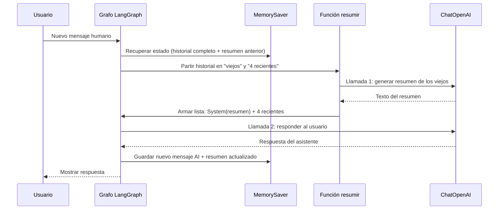

# Memoria de resumen — guía para estudiantes

## ¿Qué problema resuelve?

En un chat largo, mandar **todos** los mensajes al modelo en cada turno:

- Cuesta más (más tokens).
- Puede superar la ventana de contexto.
- A veces empeora la respuesta (demasiado ruido).

**Memoria de resumen:** los mensajes **viejos** se condensan en un **texto corto** (el resumen). Los **recientes** se mandan enteros. El modelo lee algo como:

```text
[System] Resumen de lo que hablamos antes: "El usuario se llama Mariano y preguntó por Alemania..."
[Human] ¿Qué colores tiene la bandera?
[AI] Negro, rojo y dorado...
[Human] ¿Y la capital?
```

Así “recuerda” lo antiguo sin copiar 50 mensajes palabra por palabra.

---

## Dos sitios donde vive la información (muy importante)

| Dónde | Qué guardamos |
|--------|----------------|
| **Estado del grafo + MemorySaver** | **Todos** los mensajes (humano + asistente), uno tras otro, sin borrar. |
| **Lo que enviamos al LLM en cada turno** | Si hay pocos mensajes: todos. Si hay **10 o más**: un **resumen** + solo los **4 últimos** mensajes. |

El usuario no ve el resumen en pantalla; es **contexto interno** para el modelo en esa llamada.

---

## Flujo de un turno (cuando ya hay ≥ 10 mensajes)



**Nota:** en cada turno “grande” hay **dos** llamadas al LLM: una para **resumir** y otra para **contestar**. Eso tiene coste; en producción a veces se resume solo cada N turnos.

---

## Campos del estado (`SummaryState`)

- **`messages`**: historial completo (se va **añadiendo** con `add_messages`, no se sustituye entero).
- **`conversation_summary`**: el último resumen generado (texto en una variable, no un mensaje suelto en la lista hasta que lo usamos al llamar al LLM).
- **`message_count`**: contador auxiliar (como en el artículo); aquí lo actualizamos para seguir el patrón del curso.

---

## Prueba en clase

1. Di tu nombre en el primer mensaje.
2. Haz 8–10 preguntas cortas sobre otro tema (por ejemplo un país).
3. Pregunta de nuevo por tu nombre.

- **Antes del umbral (10 mensajes):** debería recordar el nombre con normalidad.
- **Después del umbral:** el nombre puede seguir en el **resumen** si el modelo lo incluyó al resumir; si no, puede “olvidarlo” aunque siga en el historial guardado en memoria.

Eso demuestra la diferencia entre **“está guardado”** y **“el modelo lo leyó en este turno”**.

---

## Dos sintaxis de Python que suelen generar dudas

### 1. `messages_for_llm, updated_summary = build_messages_for_llm(...)`

La función **devuelve dos valores** (una tupla):

```python
return messages_for_llm, new_summary   # al final de build_messages_for_llm
```

Python permite **desempaquetar** la tupla en dos variables en una línea:

```python
messages_for_llm, updated_summary = build_messages_for_llm(all_messages, current_summary)
```

Es lo mismo que:

```python
par = build_messages_for_llm(all_messages, current_summary)
messages_for_llm = par[0]
updated_summary = par[1]
```

### 2. `out: SummaryState = { ... }` y `return out`

| Parte | Qué es |
|--------|--------|
| `out` | Nombre de variable cualquiera (= “la salida de este nodo”). |
| `: SummaryState` | Anotación de tipo: “este dict sigue la forma del estado”. No ejecuta nada especial. |
| `{ "messages": [response], ... }` | Diccionario con **solo los cambios** que queremos aplicar al estado. |
| `out["conversation_summary"] = ...` | Añadir otra clave al dict **solo si** hace falta (si el resumen cambió). |
| `return out` | LangGraph fusiona `out` con el estado guardado (historial + resumen + contador). |

**Importante:** devolver `"messages": [response]` **no borra** los mensajes antiguos. El reducer `add_messages` **concatena** `[response]` al final de la lista que ya había en memoria.

---

## Archivo a estudiar

Lee **`main.py`** en este mismo orden que aparece en el código: constantes → estado → `build_messages_for_llm` → nodo → grafo → función `chat` → bucle `if __name__`.
