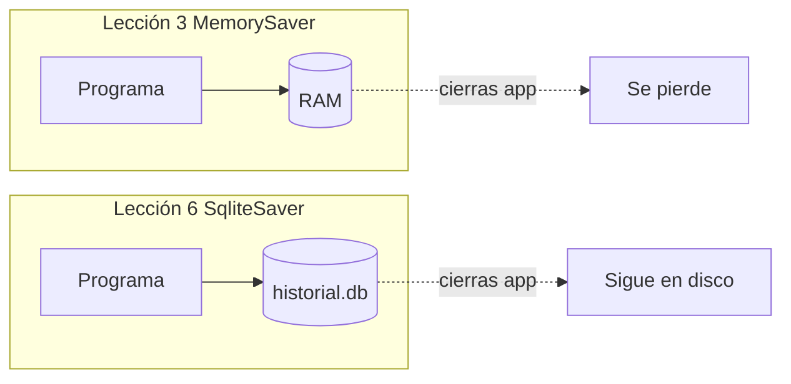

# Memoria persistente con LangGraph (SqliteSaver)

## ¿Por qué no basta `MemorySaver`?

En la **lección 3** usamos **`MemorySaver`**: el historial vive en **RAM del proceso**.

- Si cierras el terminal o apagas el PC → **se pierde**.
- No es como ChatGPT, donde mañana abres y sigue la misma conversación.

Muchas apps necesitan **memoria persistente**: guardar el estado en **disco** (o en un servidor de base de datos) para **reanudar** más tarde.

> En la transcripción del curso se menciona **Launchy / Landgraf** → en este material: **LangChain / LangGraph**.

---

## ¿Qué es un checkpointer?

Un **checkpoint** es una “foto” del **estado del grafo** después de ejecutar nodos.

El **checkpointer** es el componente que **guarda y recupera** esas fotos.

| Clase | Dónde guarda | ¿Persiste al cerrar el programa? |
|--------|----------------|-------------------------------------|
| `MemorySaver` | RAM | No |
| `SqliteSaver` | Archivo `.db` (SQLite) | Sí |
| (otros) `PostgresSaver`, etc. | Servidor PostgreSQL | Sí |

En el **proyecto Helpdesk** (tema 4) ya usasteis `SqliteSaver` para **pausar y reanudar** el flujo del grafo. Aquí es el **mismo mecanismo**, aplicado al **historial de un chat**.

---

## Cambio mínimo respecto a la lección 3

Solo cambian **tres ideas** en el código; el grafo y el nodo `chatbot` son los mismos.

### 1. Importar SQLite

```python
import sqlite3
from langgraph.checkpoint.sqlite import SqliteSaver
```

### 2. Conexión al fichero de base de datos

```python
conn = sqlite3.connect("historial.db", check_same_thread=False)
```

- Si **`historial.db` no existe**, SQLite **lo crea** al conectar.
- `check_same_thread=False` es habitual en apps con varios hilos (patrón del Helpdesk).

En nuestro `main.py` del curso la ruta apunta a la **carpeta de la lección**, para no mezclar archivos con la raíz del repo.

### 3. Compilar con `SqliteSaver` en lugar de `MemorySaver`

```python
# Lección 3 (volátil):
# memory = MemorySaver()

# Lección 6 (persistente):
memory = SqliteSaver(conn)
app = workflow.compile(checkpointer=memory)
```

**No hace falta** importar `MemorySaver` en esta lección.

---

## El papel de `thread_id`

Sigue siendo el mismo concepto que en la lección 3:

```python
config = {"configurable": {"thread_id": "sesion_terminal"}}
result = app.invoke({"messages": [HumanMessage(content=texto)]}, config)
```

LangGraph + `SqliteSaver` asocian el estado guardado a ese **`thread_id`**:

| Comportamiento | Qué hacer |
|----------------|-----------|
| **Reanudar** la misma conversación tras cerrar el programa | Mismo `thread_id` (ej. `"sesion_terminal"`) |
| **Chat nuevo** sin historial previo | Otro `thread_id` (ej. `"sesion_terminal_2"`) |

La gestión de “qué filas leer en la base de datos” la hace el framework; tú solo debes **pasar siempre** el `thread_id` correcto en `config`.

---

## Prueba en clase (como en el vídeo)

### Parte A — Guardar

1. Ejecuta `python main.py`.
2. Di: *“Me llamo Santiago”*, *“Me gusta Alemania, ¿cuántos habitantes tiene?”*
3. Escribe `salir` y **cierra** el programa.
4. Comprueba que existe **`historial.db`** en la carpeta de la lección.

### Parte B — Recuperar

1. Vuelve a ejecutar `python main.py` **sin cambiar** `THREAD_ID`.
2. Pregunta: *“¿Cómo me llamo?”* → debería recordar Santiago.
3. Pregunta: *“¿Qué país me gusta?”* → debería recordar Alemania.

### Parte C — Conversación nueva

1. En `main.py`, cambia `THREAD_ID = "sesion_terminal_2"`.
2. Ejecuta de nuevo y pregunta *“¿Cómo me llamo?”* → no debería saberlo (nueva entrada en la base de datos).

---

## Comparación visual



---

## PostgreSQL y otras opciones

LangGraph ofrece checkpointers para **PostgreSQL** y otros backends. La idea es la misma:

1. Crear conexión a la base de datos.
2. Pasar el saver al `compile(checkpointer=...)`.
3. Usar `thread_id` en cada `invoke`.

Para la mayoría de proyectos de curso y prototipos, **SQLite** basta.

---

## Qué viene después (adelanto del vídeo)

Otro enfoque para historial (en RAM o en disco) usa **bases de datos vectoriales** y técnicas parecidas a **RAG**, para recuperar fragmentos relevantes en lugar de mandar todo el chat. Eso se trata en otras unidades del curso.

---

## Cómo ejecutar

```powershell
cd "C:\Users\maria\Desktop\LangChain & LangGraph\5. Memoria y gestion del contexto\6. Memoria persistente con LangGraph"
..\..\venv\Scripts\Activate.ps1
python main.py
```

Requisito: `OPENAI_API_KEY` en el `.env` de la raíz del curso.

---

## Resumen en una frase

**Sustituyes `MemorySaver` por `SqliteSaver` con un `sqlite3.connect` a un archivo `.db`, y sigues usando el mismo `thread_id` en `config` para reanudar conversaciones entre ejecuciones.**
