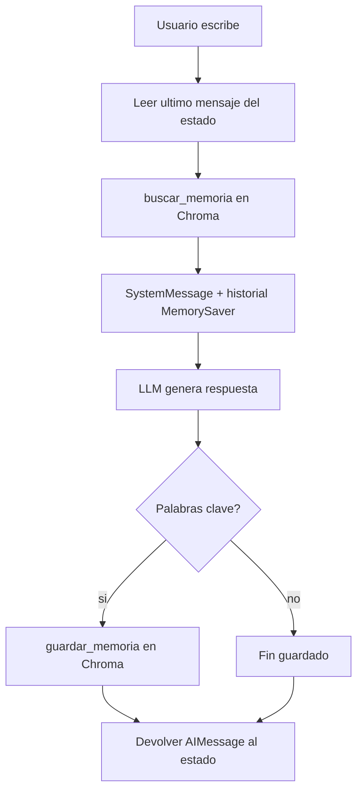

# Memoria vectorial con LangGraph (caso práctico en terminal)

Esta lección continúa el **chat en terminal** de las clases anteriores, pero ahora combina **dos tipos de memoria a la vez**. Si vienes de la lección 3 (`MemorySaver`) o de la 6 (`SqliteSaver`), aquí el foco es la **memoria general del usuario** guardada en **ChromaDB**.

---

## 1. ¿Qué problema resolvemos?

Queremos que el asistente:

1. **Recuerde la conversación actual** (qué dijiste hace dos mensajes, acuerdos de precio, etc.).
2. **Recuerde datos personales entre conversaciones distintas** (nombre, gustos, ciudad…), aunque cierres el programa o abras un “chat nuevo”.

Para (1) usamos **memoria volátil del grafo** (`MemorySaver` + `thread_id`).  
Para (2) usamos **memoria vectorial persistente** (carpeta `chroma_db` en disco).

---

## 2. Las dos memorias (explicado sin jerga)

| Memoria | Dónde vive | ¿Se pierde al cerrar el programa? | ¿Qué guarda? |
|--------|------------|-----------------------------------|--------------|
| **MemorySaver** | RAM | **Sí** | Historial de mensajes de **una** conversación (`thread_id`) |
| **ChromaDB** | Disco (`chroma_db/`) | **No** | Textos importantes del usuario (nombre, gustos…) para **todas** las sesiones |

Analogía:

- **MemorySaver** = la libreta de notas de **esta llamada telefónica**.
- **ChromaDB** = la ficha del cliente en el archivador del despacho (sirve en cualquier llamada futura).

---

## 3. ¿Qué es ChromaDB?

**ChromaDB** es una **base de datos vectorial**: guarda textos convertidos en **vectores** (listas de números) para buscar por **significado**, no solo por palabras exactas.

- Si guardaste: *“Le gusta: me encanta viajar a Alemania”*.
- Y más tarde preguntas: *“¿Qué me propones para el verano?”*.
- La búsqueda puede recuperar ese fragmento aunque no digas “Alemania” otra vez.

En el curso ya viste Chroma en el **módulo 3 (RAG)**. Aquí no recuperamos PDFs de contratos: recuperamos **recuerdos del usuario**.

---

## 4. Conceptos clave (definidos uno a uno)

### 4.1 `collection_name` / colección

Dentro de una misma carpeta de Chroma puedes tener **varias colecciones** (como “cajones” distintos).

En este ejercicio usamos una sola: **`memoria_chat`**.  
Más adelante, en un proyecto grande, podrías tener otra colección por usuario (`memoria_usuario_42`).

### 4.2 `persist_directory` / `CHROMADB_PATH`

Ruta en disco donde Chroma **guarda los archivos** de la base de datos.  
En `main.py` usamos la carpeta `chroma_db` **junto al script**, para que funcione en cualquier ordenador (no rutas fijas tipo `C:\Users\...`).

### 4.3 `vectorstore` (objeto `Chroma` de LangChain)

Es el envoltorio de LangChain sobre Chroma:

- Configura **embeddings** (`OpenAIEmbeddings`).
- Crea o abre la colección.
- Usamos `from langchain_community.vectorstores import Chroma` (mismo paquete que en el módulo 3 RAG).
- **No instales `langchain-chroma`** en este curso: fuerza `langchain-core` 1.x y rompe OpenAI/Gemini del resto de lecciones.
- Si ves un warning de deprecación al ejecutar, puedes ignorarlo en prácticas; el código sigue funcionando.

### 4.4 `client` (`chromadb.PersistentClient`)

Es el **cliente directo** de la librería Chroma (sin pasar por cadenas LCEL).

- **`PersistentClient(path=...)`**: “Conéctate a esta carpeta en disco”.
- No es el LLM ni LangGraph: solo lee/escribe en la base vectorial.

### 4.5 `collection` (`client.get_or_create_collection`)

Es el **cajón concreto** donde guardamos documentos.

Métodos que usamos en la lección:

| Método | Para qué sirve |
|--------|----------------|
| `collection.add(documents=..., ids=...)` | **Guardar** un texto nuevo |
| `collection.query(query_texts=..., n_results=k)` | **Buscar** los k textos más parecidos a una pregunta |
| `collection.get()` | **Listar** todo lo guardado (comando `memorias` en terminal) |

### 4.6 `ids` y `uuid`

Cada documento en Chroma **debe tener un id**.  
Si no pones uno, Chroma genera ids automáticos.  
Nosotros usamos `uuid.uuid4()` para tener control y no sobrescribir entradas por accidente.

### 4.7 Embeddings (`OpenAIEmbeddings`)

Función que convierte texto → vector.  
Mismo modelo al guardar y al buscar (`text-embedding-3-large`).  
Requiere **`OPENAI_API_KEY`** en el `.env` de la raíz del curso.

---

## 5. Flujo del nodo `chatbot_node` (paso a paso)



1. **Leer mensajes** del estado (`MessagesState`).
2. **Quedarse con el último** (`messages[-1].content`) → es la pregunta nueva.
3. **`buscar_memoria(ultimo_mensaje)`** → Chroma devuelve hasta 3 fragmentos relevantes.
4. **Montar `SystemMessage`** con “Información que recuerdas: …”.
5. **Invocar el LLM** con: system + historial de la sesión (eso último lo aporta MemorySaver).
6. **Guardar en Chroma** si el mensaje contiene pistas personales (heurística por palabras clave).
7. **Devolver** `{"messages": [response]}` para actualizar el grafo.

---

## 6. ¿Por qué guardamos con palabras clave y no con otro LLM?

En producción (ChatGPT “memoria actualizada”, etc.) suele haber un **segundo modelo** que analiza el mensaje y decide qué guardar.

Aquí usamos un método **rudimentario pero didáctico**:

| Si el mensaje contiene… | Guardamos algo como… |
|-------------------------|----------------------|
| `me llamo` | `El usuario se llama: …` |
| `trabajo en`, `soy programador`, etc. | `Trabajo del usuario: …` |
| `me gusta`, `me encanta` | `Le gusta: …` |
| `vivo en`, `soy de` | `Ubicacion: …` |

**Limitación:** si dices “me llamo Santiago” en un mensaje largo, puede guardarse **el mensaje entero** (como en la demo de la clase). En un proyecto real guardarías solo el nombre extraído.

---

## 7. LangGraph: grafo, `MemorySaver` y `thread_id`

### Grafo mínimo

- Un solo nodo: `chatbot`.
- Arista: `START → chatbot → END`.

### `MemorySaver` (checkpointer en RAM)

Al compilar:

```python
app = workflow.compile(checkpointer=memory)
```

Cada `invoke` con el mismo `thread_id` **recupera el historial anterior** de esa conversación.

### `thread_id` en `config`

```python
config = {"configurable": {"thread_id": "sesion_terminal"}}
```

- **`sesion_terminal`** y **`sesion_terminal_5`** = dos conversaciones distintas en RAM.
- **Ambas comparten** la misma carpeta `chroma_db` → misma memoria general.

Prueba de la lección:

1. Di “Me llamo Santiago” → se guarda en Chroma.
2. Escribe `salir` y vuelve a ejecutar el programa (MemorySaver vacío).
3. Pregunta “¿Sabes cómo me llamo?” → **sigue sabiendo el nombre** gracias a Chroma.
4. Cambia `session_id` a otro valor → chat nuevo en RAM, pero comando `memorias` muestra lo mismo en disco.

---

## 8. Funciones auxiliares del programa

### `guardar_memoria(texto)`

Escribe un documento en la colección. Imprime `[+] Guardado en memoria: ...` para que veas qué se almacenó.

### `buscar_memoria(consulta, k=3)`

Búsqueda por similitud semántica (simplificada con `collection.query`).  
En el módulo RAG usarías **Retrievers** más avanzados (MMR, MultiQuery…); aquí es a propósito **más simple**.

### `chat(mensaje, thread_id)`

Envuelve `app.invoke` y devuelve solo el texto de la última respuesta.

### `mostrar_memorias()`

Comando de terminal `memorias` → lista todo lo que hay en Chroma (memoria general).

---

## 9. Requisitos y ejecución

### Variables de entorno

En el `.env` de la raíz del repositorio:

```env
OPENAI_API_KEY=sk-...
```

### Dependencias

Con el `venv` del curso y `pip install -r requirements.txt` en la raíz basta. **No hace falta** `langchain-chroma`.

### Ejecutar la lección

```powershell
cd "5. Memoria y gestion del contexto\7. Memoria Vectorial con LangGraph"
..\..\venv\Scripts\Activate.ps1
python main.py
```

La primera ejecución crea la carpeta `chroma_db/` al lado de `main.py`.

### Comandos en el chat

| Entrada | Efecto |
|---------|--------|
| Texto normal | Conversación (RAM + consulta a Chroma) |
| `memorias` | Ver todo lo guardado en disco |
| `salir` | Cerrar el programa |

---

## 10. Ejemplo de sesión (como en la clase)

```
Tu: Hola, me llamo Santiago. Como te llamas?
[+] Guardado en memoria: El usuario se llama: Hola, me llamo Santiago...
Asistente: Hola Santiago, ...

Tu: Me encanta viajar, creo que Alemania puede ser un gran destino...
[+] Guardado en memoria: Le gusta: Me encanta viajar...
Asistente: (recomienda ciudades...)

(memorias)
[+] Memorias guardadas:
  1. El usuario se llama: ...
  2. Le gusta: ...
```

Si reinicias el programa y preguntas de nuevo por tu nombre, **MemorySaver no tiene el historial viejo**, pero **Chroma sí**.

---

## 11. Relación con otras lecciones del tema 5

| Lección | Qué aporta a esta |
|---------|-------------------|
| 3 – MemorySaver | Misma idea de `thread_id` y grafo con un nodo |
| 4 – Ventana deslizante | Podrías recortar mensajes antes del LLM (aquí no lo hacemos) |
| 6 – SqliteSaver | Podrías persistir **también** el historial en disco además de Chroma |
| 7 – Esta lección | Chroma = memoria **semántica** entre sesiones |
| Proyecto NPC | Misma arquitectura de grafo; sin memoria vectorial aún |

---

## 12. Próximo paso del curso

El profesor indica que el siguiente paso es un **proyecto más grande** con interfaz gráfica: varios usuarios, varias sesiones, memoria general por usuario, etc. Este script es la base mínima para entender **cómo combinar checkpoint + vector store**.

---

## 13. Preguntas frecuentes (estudiantes)

**¿Por qué hay `vectorstore` Y también `client` + `collection`?**  
`vectorstore` inicializa bien la colección con LangChain/embeddings. `collection` permite enseñar la API cruda (`add`/`query`) sin montar un Retriever completo.

**¿`client` y `collection` son lo mismo?**  
No. `client` es la conexión al archivo en disco. `collection` es un “cajón” concreto dentro de ese archivo.

**¿Por qué no se borra Chroma al salir?**  
Porque está en disco. MemorySaver sí se borra al cerrar el proceso.

**¿Puedo usar `SqliteSaver` y Chroma a la vez?**  
Sí. SQLite para historial de mensajes; Chroma para hechos/perfil del usuario. Es un patrón muy habitual.

**¿El warning de Chroma deprecado?**  
Usa `from langchain_community.vectorstores import Chroma` (como en `main.py` y en el módulo RAG).

---

## 14. Archivos de esta lección

```text
7. Memoria Vectorial con LangGraph/
├── main.py                              # Codigo comentado linea a linea
├── Teoria_Memoria_Vectorial_LangGraph.md  # Este documento
└── chroma_db/                           # Se crea al ejecutar (no subir a Git)
```

El `.gitignore` del curso ya ignora `**/chroma_db/` para no versionar bases locales.
