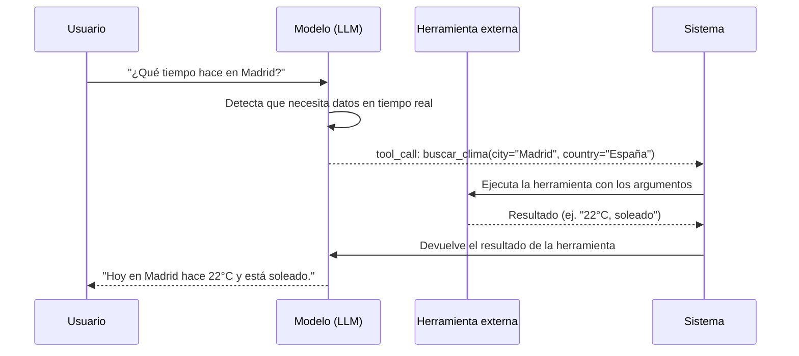

# Herramientas Externas (Tools) en LangChain y LangGraph

Bienvenidos a la **Unidad 6**. A partir de aquí entramos en uno de los bloques más interesantes del curso: conceptos avanzados de LangChain y LangGraph relacionados con **herramientas (Tools)**, **agentes de IA** y **sistemas multiagente**.

En esta primera lección nos centraremos exclusivamente en el concepto de herramienta y en cómo implementar la primera con LangChain. Comprender bien este fundamento es imprescindible antes de pasar a agentes y arquitecturas más complejas.

---

## 1. ¿Qué es una herramienta (Tool)?

Una **herramienta** es una funcionalidad externa que un modelo de lenguaje (LLM) puede utilizar para **realizar acciones más allá de la generación de texto**.

Ejemplos habituales de herramientas:

- Consultar el clima actual de una ciudad.
- Ejecutar código Python para resolver un cálculo matemático.
- Buscar información en internet.
- Consultar una base de datos o una API externa.

El concepto es **transversal**: aplica igual en LangChain, LangGraph y en el ecosistema de LLMs en general. Lo que cambia entre frameworks es la forma concreta de definir e integrar esas herramientas, pero la idea subyacente es siempre la misma.

---

## 2. Herramientas vs. nodos en LangGraph: una diferencia clave

Si has seguido el curso hasta ahora, es probable que pienses: *"¿Pero no hemos hecho ya cosas parecidas con LangGraph?"*

Y tendrías razón en parte. Con LangGraph ya hemos implementado nodos que realizan acciones que no implican generar texto: cálculos matemáticos, búsquedas, consultas a APIs, etc.

La diferencia fundamental no está en **qué** hace la funcionalidad externa, sino en **quién decide cuándo ejecutarla**:

| Enfoque | ¿Quién decide ejecutar la acción? | ¿Cómo se orquesta? |
| :--- | :--- | :--- |
| **Nodo en LangGraph** | El desarrollador | Tú defines el flujo (secuencial, condicional, con bucles…) y decides en qué momento se invoca cada nodo. |
| **Herramienta (Tool)** | El propio LLM | El modelo analiza la petición del usuario y **decide por sí mismo** si necesita invocar una herramienta y cuál. |

> [!IMPORTANT]
> En el paradigma de herramientas, **no eres tú quien define el flujo de ejecución**. Es el LLM quien, en un momento determinado, evalúa si necesita una funcionalidad externa y la solicita.

Esta distinción es la base sobre la que se construyen los **agentes de IA**: sistemas donde el modelo no solo responde con texto, sino que puede **actuar** sobre el entorno mediante herramientas.

---

## 3. El enfoque antiguo: instrucciones en el prompt

Antes de que los modelos modernos soportaran la invocación nativa de herramientas, la estrategia era **instruir al LLM mediante el system prompt** para que, cuando detectara que necesitaba una funcionalidad externa, devolviera un texto estructurado que nosotros interpretáramos.

### Ejemplo: consultar el clima de Madrid

Imagina que el usuario pregunta: *"¿Qué tiempo hace hoy en Madrid?"*

Un LLM entrenado con datos históricos **no puede saber el clima actual del día de hoy**. Necesita consultar una fuente externa. Antiguamente, instruíamos al modelo para que respondiera algo como:

```
Necesito usar una herramienta de búsqueda con el término: clima Madrid
```

Nuestro código entonces:

1. **Interpretaba** ese texto de respuesta.
2. **Extraía** qué herramienta invocar y con qué parámetros.
3. **Ejecutaba** la herramienta externa (por ejemplo, mediante un nodo en LangGraph).
4. **Devolvía** el resultado al LLM para que elaborara la respuesta final.

Este enfoque funcionaba, pero tenía problemas evidentes:

- Dependía de que el modelo siguiera las instrucciones del prompt al pie de la letra.
- El formato de respuesta no era estándar: cada proyecto podía usar convenciones distintas.
- Parsear texto libre es frágil y propenso a errores.
- No había garantías sobre los tipos de los argumentos (cadena, número, booleano…).

---

## 4. El enfoque moderno: Tool Calling nativo

Los modelos actuales —como GPT-4, Claude, Gemini y otros— incluyen soporte nativo para la **invocación de herramientas** (*tool calling*). En lugar de generar texto describiendo qué herramienta necesita, el modelo produce **llamadas estructuradas en formato JSON**.

### Ejemplo de respuesta estructurada

Cuando el usuario pregunta por el clima de Madrid, el modelo puede devolver algo equivalente a:

```json
{
  "tool": "buscar_clima",
  "tool_call_id": "call_abc123",
  "arguments": {
    "ciudad": "Madrid",
    "pais": "España"
  }
}
```

Lo que esto nos aporta:

- **Estandarización:** El formato es predecible y fácil de procesar programáticamente.
- **Tipado de argumentos:** El modelo indica qué argumentos necesita la herramienta y de qué tipo son (cadena de texto, número, etc.).
- **Identificador de llamada:** Cada invocación tiene un `tool_call_id` que permite rastrear y correlacionar la respuesta de la herramienta con la petición original.
- **Integración simplificada:** Los frameworks como LangChain y LangGraph gestionan gran parte de este ciclo de forma automática.



---

## 5. Definir herramientas en LangChain y LangGraph

Para que el *tool calling* funcione, no basta con que el modelo soporte herramientas: **nosotros también debemos definir nuestras herramientas en un formato que el framework pueda entender y registrar**.

Esto implica, como mínimo:

1. **Un nombre** identificativo de la herramienta.
2. **Una descripción** clara de para qué sirve (el LLM la usa para decidir si debe invocarla).
3. **Una función** que implementa la lógica real (ejecutar código, llamar a una API, etc.).
4. **Un esquema de argumentos** (explícito o inferido) que indique qué parámetros acepta.

En LangChain, la forma más directa de empezar es mediante la clase `Tool` del módulo `langchain_core.tools`. En LangGraph, las herramientas se integran habitualmente dentro de grafos de agentes, que veremos en lecciones posteriores.

> [!TIP]
> LangGraph suele ser la opción preferida cuando construyes **agentes completos** con ciclos de razonamiento, memoria y múltiples herramientas. LangChain ofrece una forma más sencilla y directa para **definir y probar herramientas de forma aislada**, que es justo lo que haremos en esta lección.

---

## 6. Resumen de conceptos clave

| Concepto | Definición breve |
| :--- | :--- |
| **Tool (Herramienta)** | Funcionalidad externa que el LLM puede invocar para actuar más allá de generar texto. |
| **Tool Calling** | Mecanismo nativo de los LLM modernos para solicitar herramientas mediante llamadas JSON estructuradas. |
| **Agente de IA** | Sistema donde el LLM decide autónomamente qué herramientas usar y cuándo (lo veremos en próximas lecciones). |
| **Nodo vs. Tool** | Un nodo lo invocas tú en el flujo; una tool la invoca el propio LLM según el contexto. |

---

## 7. Qué verás en el código de esta lección

En el ejercicio práctico de esta lección implementaremos nuestra **primera herramienta con LangChain**:

- Utilizaremos `PythonREPL`, una utilidad que permite ejecutar código Python en un intérprete.
- La envolveremos con la clase `Tool` de LangChain, definiendo su nombre, función y descripción.
- La invocaremos directamente con `tool.run(...)` para comprobar que funciona antes de conectarla a un agente.

Este es el primer paso de una escalera que nos llevará desde una herramienta aislada hasta sistemas donde el LLM elige por sí mismo qué herramienta usar en cada situación.

---

> [!NOTE]
> **Lectura recomendada antes de practicar:** Asegúrate de haber comprendido la diferencia entre un nodo de LangGraph (flujo definido por ti) y una herramienta (decisión del LLM). Esa distinción es la que separa una aplicación con pasos fijos de un verdadero agente de IA.
